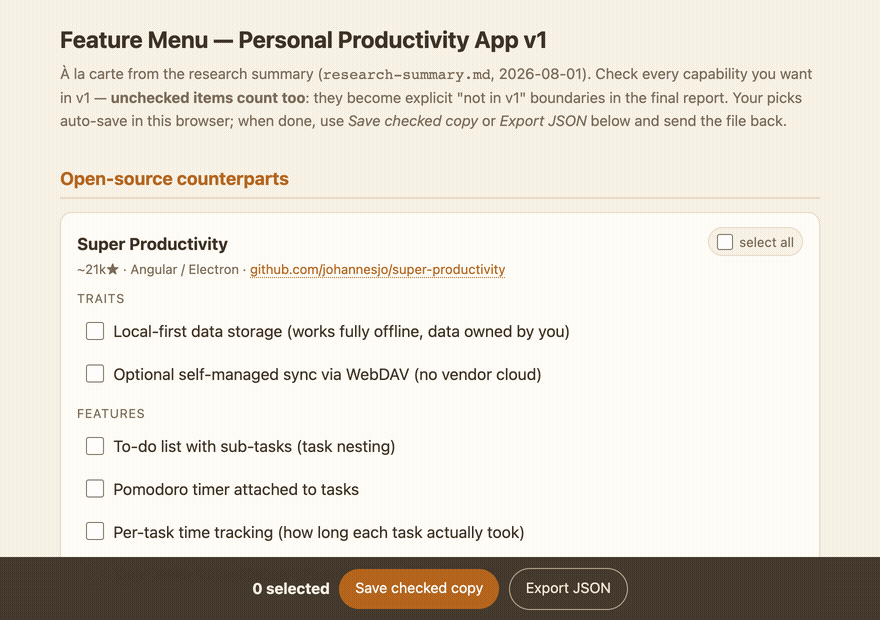

# murPick

**AI research, à la carte.**

> Don't read the report — **order from it.** You pick the dishes, AI does
> the cooking, and nothing off-menu makes it to the table.



Ask an AI to research competing products and you get a 5,000-word report. By the
time you reach the end you've forgotten the beginning — and somewhere in the
middle, the AI quietly decided your feature set *for* you.

murPick is an [Agent Skill](https://agentskills.io) that turns product research
into something you already know how to use: **a menu**. The AI digests your
reference materials, researches the field, then serves every candidate feature
as a checkbox. You order like you're at a restaurant. What you check goes into
the spec. What you *don't* check becomes explicit boundaries — "decided against"
instead of "forgotten".

## How it works

1. **Digest** — you drop in screenshots, screen recordings, links, or a folder.
   The skill inspects everything (video frames included), renames files
   descriptively, dedupes, and identifies each product.
2. **Research** — open-source counterparts, commercial leaders, category
   overview. With honesty rules: features that demo well but demand manual data
   entry get flagged, real-world API/ToS barriers get named.
3. **The menu** — a single self-contained HTML file. Every feature is a
   checkbox with a stable id, grouped into product cards with source links.
   Auto-saves as you tap (localStorage). Works on your phone.
4. **The report** — send the checked file back. Checked items map into
   capability domains — none dropped. Unchecked items become the boundary list.
   You get an HTML report with decision tables, a pure-CSS architecture
   diagram, and an honest risk table.

The round trip is the trick: the menu's **"Save as checked copy"** button burns
your checkbox state into the HTML itself (`data-burned` attributes) and
downloads it. No account, no server, no copy-pasting a wall of Markdown from
your phone. The file *is* the data.

## Why a menu?

Because the failure mode of AI-assisted product research isn't bad research —
it's **decision laundering**. In our baseline tests (same materials, same
prompts, no skill), the agent produced a competent report that ended with:

> "V1 = one skeleton + three modules + one principle… Definitive don't-build
> list (write it into the README to prevent scope creep)"

The user never picked anything. The AI picked. With murPick, the same agent
produced a 97-item menu and handed the choosing back to the human. Granularity
matters too: the no-skill baseline compressed the field into 19 theme-level
bullets; the menu preserved 97–143 individually checkable features.

## Install

Claude Code:

```bash
git clone https://github.com/ymustc/murPick.git ~/.claude/skills/murpick
```

Runtimes that read `~/.agents/skills/` (Codex, Copilot CLI, Gemini CLI):

```bash
git clone https://github.com/ymustc/murPick.git ~/.agents/skills/murpick
```

**Compatibility note:** murPick follows the open
[Agent Skills spec](https://agentskills.io) and its pipeline only needs
common tools (shell, a web-fetch tool, ffmpeg for videos, Node for the
validator). It is battle-tested on Claude Code; on other runtimes it should
work but hasn't been formally tested — reports and issues are very welcome.
It also works with any Anthropic-compatible model endpoint behind Claude Code.

## Use

> I collected screenshots of habit-tracker apps I like in ./refs — help me
> research this space, I want to decide what my own app's v1 should include.

or simply:

> Make me a feature menu from this research.

When you've checked your picks, hit **Save as checked copy** and send the
downloaded file back:

> Here's my checked menu — write the selection report.

## No-install fallback

A useful chunk of the discipline works as a plain prompt convention: split
research and selection into two passes, ban the research pass from
recommending anything, and require the rejects to be listed as explicit
boundaries (credit: launch-thread feedback). What the skill's artifact adds
on top is per-item granularity, the burn-and-save round trip, and a
validator-checked guarantee that every unchecked item resurfaces in the
report.

## Quality: tested like code, not vibed

This skill was built with TDD for documentation
([RED-GREEN-REFACTOR](https://github.com/obra/superpowers)): baseline runs
without the skill documented real failures verbatim; every clause targets one;
pressure tests (time pressure, ill-fitting materials) closed the loopholes.

Machine-checkable requirements are enforced by script, not prose:
`scripts/validate-menu.js` runs 12 hard checks on every generated menu
(checkbox id uniqueness, burn-and-save logic, localStorage, self-containment…).
In our test suite it fails the no-skill baseline menu 5/12 and passes every
skill-generated menu including a real 143-item case.

## Examples

See [`examples/`](examples/) for a generated menu, a checked copy, and the
resulting report.

---

Part of the **mur** toolkit by [Miao YU](https://github.com/ymustc).
中文说明见 [README.zh-CN.md](README.zh-CN.md)。

MIT License.
